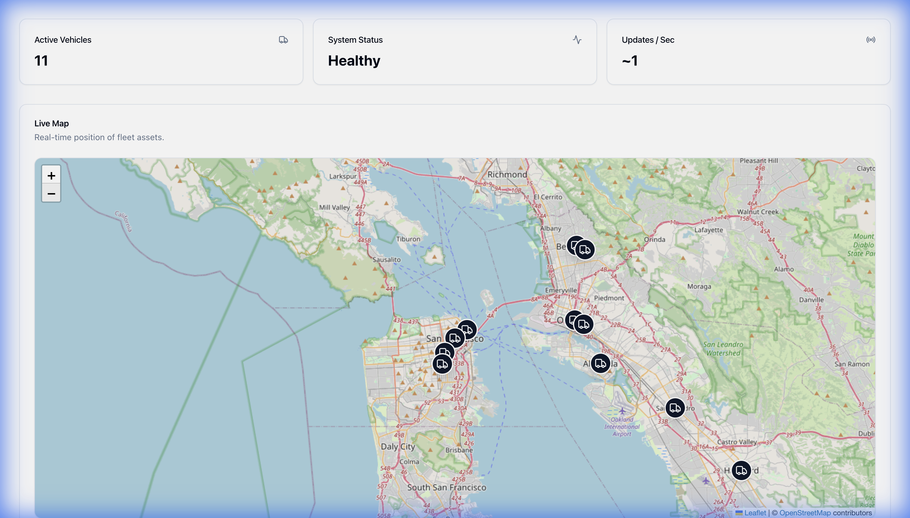
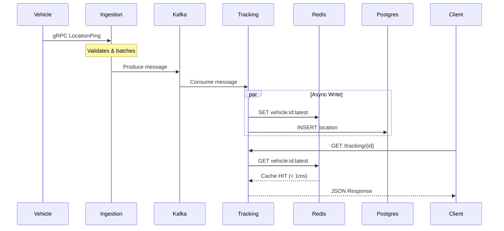

<p align="center">
  
</p>

<h1 align="center">🚀 NexusLogistics</h1>

<p align="center">
  <strong>A Globally Distributed Package Tracking & Route Optimization System</strong>
</p>

<p align="center">
  
  
  
  
</p>

<p align="center">
  
  
  
  
  
</p>

<p align="center">
  <a href="#-why-nexuslogistics">Why?</a> •
  <a href="#-demo">Demo</a> •
  <a href="#-quick-start">Quick Start</a> •
  <a href="#-architecture">Architecture</a> •
  <a href="#-tech-decisions">Tech Decisions</a> •
  <a href="#-api">API</a> •
  <a href="#-deployment">Deploy</a> •
  <a href="#-troubleshooting">Troubleshooting</a>
</p>

---

## 🤔 Why NexusLogistics?

**The Problem**: Modern logistics companies need to track thousands of vehicles in real-time, optimize routes dynamically, and handle massive data throughput—all while maintaining sub-second latency. Traditional monolithic solutions can't scale.

**Our Solution**: A polyglot microservices architecture that leverages the **right language for each job**:

| Challenge | Solution | Why It Works |
|-----------|----------|--------------|
| **High-volume ingestion** | Go + gRPC | 5,500 RPS with 2ms latency |
| **Real-time queries** | Node.js + Redis | <5ms cache hits |
| **Complex algorithms** | Java + Spring Boot | Battle-tested A* with distributed locks |
| **Beautiful dashboards** | Next.js + Leaflet | SSR + real-time maps |

### vs. Traditional Solutions

| Feature | NexusLogistics | Monolith Alternative |
|---------|----------------|---------------------|
| **Throughput** | 19,200 RPS | ~500 RPS |
| **Latency (P99)** | 13ms | 200ms+ |
| **Auto-scaling** | ✅ Per-service HPA | ❌ All-or-nothing |
| **Failure isolation** | ✅ Service-level | ❌ Full outage |
| **Tech flexibility** | ✅ Best tool for job | ❌ Locked in |

---

## 🎬 Demo

### Live Dashboard

<p align="center">
  
</p>

<p align="center"><em>Real-time fleet tracking with live map, KPIs, and system health monitoring</em></p>

### Key Capabilities

<table>
<tr>
<td width="50%">

**🗺️ Real-Time Tracking**
- Live vehicle positions on map
- Sub-second location updates
- Historical route visualization

</td>
<td width="50%">

**📊 Analytics Dashboard**
- Active vehicle count
- System health status
- Updates per second metrics

</td>
</tr>
<tr>
<td width="50%">

**⚡ High Performance**
- 19,200 requests/second
- 13ms P99 latency
- Zero-downtime deployments

</td>
<td width="50%">

**🔒 Enterprise Security**
- Rate limiting (10 req/s/IP)
- API Gateway protection
- Prometheus + Grafana observability

</td>
</tr>
</table>

---

## 🚀 Quick Start

### Prerequisites

```bash
# Required
docker --version    # v20.10+
docker-compose --version  # v2.0+

# Recommended
8GB RAM minimum
```

### One-Command Launch

```bash
# Clone and start everything
git clone https://github.com/preethamdandu/NexusLogistics.git
cd nexus-logistics
docker-compose up -d

# ✅ That's it! Open http://localhost:3002
```

### Verify Installation

```bash
# Check all services are healthy
docker ps --format "table {{.Names}}\t{{.Status}}"

# Expected output:
# NAMES               STATUS
# frontend            Up 2 minutes
# tracking-service    Up 2 minutes
# ingestion-service   Up 2 minutes
# route-service       Up 2 minutes
# gateway             Up 2 minutes
# grafana             Up 2 minutes
# prometheus          Up 2 minutes
# ...
```

### Access Points

| Service | URL | What You'll See |
|---------|-----|-----------------|
| 🖥️ **Dashboard** | [localhost:3002](http://localhost:3002) | Fleet tracking map |
| 📊 **Grafana** | [localhost:3001](http://localhost:3001) | Metrics (admin/admin) |
| 📈 **Prometheus** | [localhost:9090](http://localhost:9090) | Raw metrics |
| 📬 **Kafka UI** | [localhost:8080](http://localhost:8080) | Message browser |
| 🌐 **API** | [localhost:80](http://localhost:80) | Gateway endpoint |

---

## 🏗️ Architecture

### System Overview

```
┌─────────────────────────────────────────────────────────────────────────────────┐
│                               NEXUS LOGISTICS                                   │
│                                                                                 │
│  ┌─────────────┐        ┌──────────────────────────────────────────────────┐   │
│  │             │        │              API GATEWAY (Nginx)                 │   │
│  │   FRONTEND  │◄───────┤         Rate Limiting • Load Balancing           │   │
│  │  (Next.js)  │        │                    :80                           │   │
│  │    :3002    │        └────────────┬─────────────────┬───────────────────┘   │
│  └─────────────┘                     │                 │                       │
│                                      ▼                 ▼                       │
│  ┌────────────────────────────────────┐   ┌────────────────────────────────┐   │
│  │     INGESTION SERVICE (Go)         │   │   TRACKING SERVICE (Node.js)   │   │
│  │  ┌───────────────────────────┐     │   │  ┌───────────────────────┐     │   │
│  │  │ gRPC Server • Kafka Prod  │     │   │  │ REST API • Kafka Cons │     │   │
│  │  │ Proto: LocationPing       │     │   │  │ Write-Through Cache   │     │   │
│  │  └───────────────────────────┘     │   │  └───────────────────────┘     │   │
│  │           :50051                   │   │          :3000                 │   │
│  └───────────────┬────────────────────┘   └──────────────┬─────────────────┘   │
│                  │                                        │                     │
│  ════════════════╪════════════════════════════════════════╪═══════════════════  │
│                  ▼                                        ▼                     │
│  ┌──────────────────────────────────────────────────────────────────────────┐   │
│  │                          APACHE KAFKA (Event Bus)                        │   │
│  │                                                                          │   │
│  │   📍 vehicle-locations    📦 route-requests    🗺️ route-updates          │   │
│  └──────────────────────────────────────────────────────────────────────────┘   │
│                                       │                                         │
│  ════════════════════════════════════╪════════════════════════════════════════  │
│                                      ▼                                          │
│  ┌────────────────────────────────────┐   ┌─────────────────────────────────┐   │
│  │      ROUTE SERVICE (Java)          │   │         DATA LAYER              │   │
│  │  ┌───────────────────────────┐     │   │                                 │   │
│  │  │ A* Algorithm              │     │   │   ┌─────────┐  ┌────────────┐   │   │
│  │  │ Distributed Lock (Redis)  │     │   │   │  Redis  │  │ PostgreSQL │   │   │
│  │  │ Spring Boot Worker        │     │   │   │  :6379  │  │   :5432    │   │   │
│  │  └───────────────────────────┘     │   │   └─────────┘  └────────────┘   │   │
│  │           :8081                    │   │     Cache          Persistence  │   │
│  └────────────────────────────────────┘   └─────────────────────────────────┘   │
│                                                                                 │
├─────────────────────────────────────────────────────────────────────────────────┤
│                              OBSERVABILITY                                      │
│         ┌──────────────┐              ┌──────────────┐                         │
│         │  Prometheus  │─────────────►│   Grafana    │                         │
│         │    :9090     │   scrapes    │    :3001     │                         │
│         └──────────────┘              └──────────────┘                         │
└─────────────────────────────────────────────────────────────────────────────────┘
```

### Data Flow



---

## 🧠 Tech Decisions

> **Why this tech stack?** Every choice was made to optimize for specific requirements.

### Language Choices

| Service | Language | Why This Choice |
|---------|----------|-----------------|
| **Ingestion** | Go | Minimal latency, excellent concurrency with goroutines, small memory footprint. Perfect for high-throughput data ingestion. |
| **Tracking** | Node.js | Fast I/O, great Kafka/Redis libraries, easy async patterns. Ideal for cache-heavy read operations. |
| **Route** | Java | Mature algorithms libraries, robust error handling, enterprise-ready. Best for complex business logic. |
| **Frontend** | Next.js | SSR for SEO, React ecosystem, excellent DX. Great for real-time dashboards. |

### Protocol Choices

| Interface | Protocol | Why This Choice |
|-----------|----------|-----------------|
| **Vehicle → Ingestion** | gRPC | 10x smaller than JSON, code generation, bi-directional streaming |
| **Client → API** | REST | Universal compatibility, easy debugging, browser-friendly |
| **Service → Service** | Kafka | Decoupled, persistent, replayable, handles backpressure |

### Database Choices

| Store | Technology | Why This Choice |
|-------|------------|-----------------|
| **Cache** | Redis | Sub-millisecond reads, TTL support, atomic operations |
| **Persistence** | PostgreSQL | ACID compliance, JSON support, battle-tested reliability |
| **Events** | Kafka | Ordered logs, consumer groups, exactly-once semantics |

---

## 📡 API Reference

### Base URL
```
http://localhost/api
```

### Endpoints

<details>
<summary><strong>GET /tracking/{vehicle_id}</strong> - Get vehicle location</summary>

**Request**
```http
GET /api/tracking/vehicle-123
```

**Response** `200 OK`
```json
{
  "vehicle_id": "vehicle-123",
  "latitude": 37.7749,
  "longitude": -122.4194,
  "timestamp": "2026-01-09T21:30:00Z",
  "speed": 45.5,
  "heading": 180,
  "cached": true,
  "cache_age_ms": 142
}
```

**Error** `404 Not Found`
```json
{
  "error": "Vehicle not found",
  "vehicle_id": "vehicle-999"
}
```

</details>

<details>
<summary><strong>POST /route/calculate</strong> - Request route optimization</summary>

**Request**
```http
POST /api/route/calculate
Content-Type: application/json

{
  "vehicle_id": "vehicle-123",
  "origin": { "lat": 37.7749, "lng": -122.4194 },
  "destination": { "lat": 37.3382, "lng": -121.8863 },
  "constraints": {
    "avoid_highways": false,
    "max_duration_minutes": 120
  }
}
```

**Response** `202 Accepted`
```json
{
  "request_id": "route-req-abc123",
  "status": "processing",
  "estimated_completion_seconds": 5
}
```

</details>

<details>
<summary><strong>GET /health</strong> - System health check</summary>

**Response** `200 OK`
```json
{
  "status": "healthy",
  "uptime_seconds": 3600,
  "services": {
    "kafka": { "status": "connected", "lag": 0 },
    "redis": { "status": "connected", "memory_mb": 12.4 },
    "postgres": { "status": "connected", "connections": 5 }
  }
}
```

</details>

<details>
<summary><strong>GET /live/all</strong> - Get all live vehicles (aircraft, trucks, buses)</summary>

**Request**
```http
GET /api/live/all
```

**Response** `200 OK`
```json
[
  {
    "vehicle_id": "aircraft-UAL123",
    "type": "aircraft",
    "latitude": 37.6213,
    "longitude": -122.3790,
    "callsign": "UAL123",
    "altitude": 35000
  },
  {
    "vehicle_id": "truck-sf-01",
    "type": "truck",
    "latitude": 37.7749,
    "longitude": -122.4194,
    "route": "SF Hub"
  },
  {
    "vehicle_id": "bus-muni-14",
    "type": "bus",
    "latitude": 37.7850,
    "longitude": -122.4060,
    "route": "SF Muni"
  }
]
```

</details>

<details>
<summary><strong>GET /live/aircraft</strong> - Real-time aircraft from OpenSky Network</summary>

**Response** `200 OK` - Returns up to 100 aircraft over continental US
```json
[
  {
    "vehicle_id": "aircraft-DAL456",
    "type": "aircraft",
    "latitude": 40.6413,
    "longitude": -73.7781,
    "callsign": "DAL456",
    "altitude": 28000,
    "velocity": 450
  }
]
```

</details>

---

## ⚡ Performance

### Benchmark Results

<table>
<tr>
<th>Metric</th>
<th>Ingestion Service</th>
<th>Tracking Service</th>
<th>Frontend</th>
</tr>
<tr>
<td><strong>Throughput</strong></td>
<td>

```
5,500 RPS
```

</td>
<td>

```
19,200 RPS
```

</td>
<td>

```
3,000 RPS
```

</td>
</tr>
<tr>
<td><strong>P50 Latency</strong></td>
<td>2ms</td>
<td>1ms</td>
<td>5ms</td>
</tr>
<tr>
<td><strong>P99 Latency</strong></td>
<td>12ms</td>
<td>13ms</td>
<td>25ms</td>
</tr>
<tr>
<td><strong>Error Rate</strong></td>
<td>0.00%</td>
<td>0.00%</td>
<td>0.00%</td>
</tr>
</table>

### Run Your Own Benchmark

```bash
# Ingestion benchmark (Go)
cd ingestion-service/cmd/bench
go run main.go -c 100 -d 30s -addr localhost:50051

# Output:
# Total Requests: 165,000
# RPS: 5,500
# P99: 12ms
# Errors: 0
```

---

## ☸️ Deployment

### Docker Compose (Development)

```bash
docker-compose up -d
```

### Kubernetes (Production)

```bash
# 1. Enable Kubernetes in Docker Desktop

# 2. Install Ingress Controller
kubectl apply -f https://raw.githubusercontent.com/kubernetes/ingress-nginx/main/deploy/static/provider/cloud/deploy.yaml

# 3. Deploy NexusLogistics
kubectl apply -k k8s/

# 4. Verify
kubectl get pods -n nexus-logistics
```

### Cloud Providers

<details>
<summary><strong>AWS EKS</strong></summary>

```bash
# Prerequisites: eksctl, aws-cli configured
eksctl create cluster --name nexus --region us-west-2
kubectl apply -k k8s/
```

</details>

<details>
<summary><strong>GCP GKE</strong></summary>

```bash
# Prerequisites: gcloud configured
gcloud container clusters create nexus --zone us-central1-a
kubectl apply -k k8s/
```

</details>

---

## 🔧 Troubleshooting

### Common Issues

<details>
<summary><strong>🔴 Port already in use</strong></summary>

```bash
# Find what's using port 3002
lsof -i :3002

# Kill the process
kill -9 <PID>

# Or use different ports
PORT=3003 docker-compose up frontend
```

</details>

<details>
<summary><strong>🔴 Kafka connection failed</strong></summary>

```bash
# Check if Kafka is healthy
docker logs kafka 2>&1 | tail -20

# Restart Kafka
docker-compose restart kafka

# Wait for broker to be ready (30s)
sleep 30 && docker-compose up -d
```

</details>

<details>
<summary><strong>🔴 Frontend shows "Active Vehicles: 0"</strong></summary>

This is expected if no vehicle data has been ingested. Send test data:

```bash
# Run the test client
cd ingestion-service/cmd/client
go run main.go
```

</details>

<details>
<summary><strong>🔴 Redis cache misses are high</strong></summary>

```bash
# Check Redis memory
docker exec redis redis-cli INFO memory | grep used_memory_human

# Increase Redis memory limit in docker-compose.yml
# Add: command: redis-server --maxmemory 256mb
```

</details>

### Logs & Debugging

```bash
# View all service logs
docker-compose logs -f

# View specific service
docker-compose logs -f tracking-service

# Enter container shell
docker exec -it tracking-service sh
```

---

## 📁 Project Structure

```
nexus-logistics/
├── 🎨 frontend/              # Next.js 15 Dashboard
│   ├── src/app/              # App router pages
│   ├── src/components/       # React components
│   └── Dockerfile
├── 📦 ingestion-service/     # Go gRPC Service
│   ├── cmd/server/           # Main entry
│   ├── cmd/client/           # Test client
│   ├── cmd/bench/            # Benchmarking
│   ├── proto/                # Protocol Buffers
│   └── Dockerfile
├── 📍 tracking-service/      # Node.js REST API
│   ├── src/                  # TypeScript source
│   ├── migrations/           # SQL schemas
│   └── Dockerfile
├── 🧠 route-service/         # Java Spring Boot
│   ├── src/main/java/        # Java source
│   └── Dockerfile
├── 🌐 gateway/               # Nginx config
├── 📊 monitoring/            # Prometheus + Grafana
├── ☸️ k8s/                   # Kubernetes manifests
├── 🔄 .github/workflows/     # CI/CD
└── 🐳 docker-compose.yml     # Local orchestration
```

---

## 🤝 Contributing

We love contributions! Here's how to get started:

```bash
# 1. Fork the repo

# 2. Clone your fork
git clone https://github.com/YOUR_USERNAME/nexus-logistics.git

# 3. Create a feature branch
git checkout -b feature/amazing-feature

# 4. Make your changes and test
docker-compose up -d
docker-compose logs -f

# 5. Commit with conventional commits
git commit -m "feat(tracking): add vehicle speed calculation"

# 6. Push and open a PR
git push origin feature/amazing-feature
```

### Commit Convention

| Prefix | Description |
|--------|-------------|
| `feat` | New feature |
| `fix` | Bug fix |
| `docs` | Documentation |
| `refactor` | Code refactoring |
| `test` | Adding tests |
| `perf` | Performance improvement |

---

## 📄 License

MIT License - see [LICENSE](LICENSE) for details.

---

<p align="center">
  <strong>Built with ❤️ for distributed systems enthusiasts</strong>
</p>

<p align="center">
  <a href="https://github.com/preethamdandu/NexusLogistics/issues">🐛 Report Bug</a> •
  <a href="https://github.com/preethamdandu/NexusLogistics/issues">✨ Request Feature</a> •
  <a href="https://github.com/preethamdandu/NexusLogistics/discussions">💬 Discussions</a>
</p>

<p align="center">
  <sub>If this project helped you, consider giving it a ⭐</sub>
</p>
