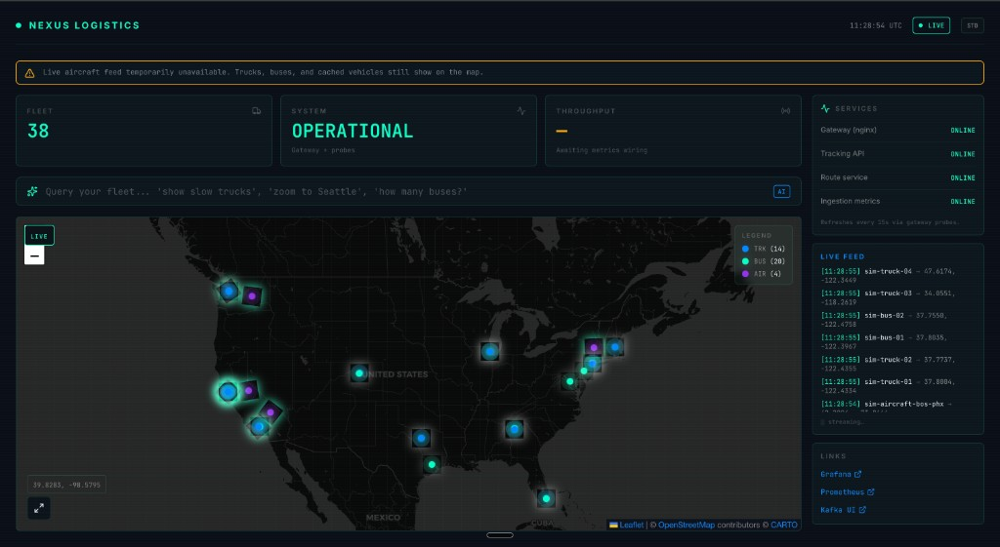
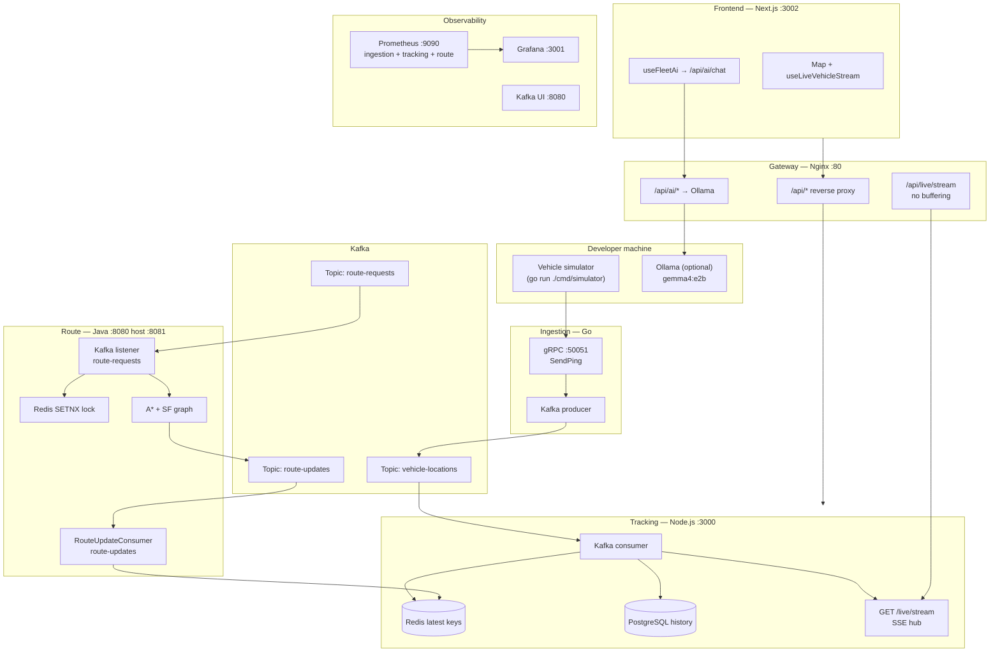

<p align="center">
  
</p>

<h1 align="center">NexusLogistics</h1>

<p align="center"><strong>Real-time distributed vehicle tracking with AI-assisted fleet control</strong></p>

<p align="center">
  <a href="https://github.com/preethamdandu/NexusLogistics/actions/workflows/test.yaml"></a>
  
  
  
  
  
  
  
  
</p>

---

## What this is

**NexusLogistics** is a **polyglot microservices** demo: **Go** ingests vehicle pings over **gRPC**, **Kafka** moves events, **Node.js** serves a cache-aside **REST** API and **Server-Sent Events** to the browser, and **Java / Spring Boot** consumes route jobs, runs **A\*** on a small **San Francisco road graph**, and publishes results back through Kafka. A **Next.js** dashboard shows a dark **command-center** map (**Leaflet** + **CARTO** dark tiles) with smooth marker motion. An optional **AI command bar** sends natural language to **Ollama** (`gemma4:e2b`) through the **Nginx** gateway and turns structured JSON into map actions—**no cloud LLM**, no API keys.

See the full **[Getting Started](GETTING_STARTED.md)** guide to clone the stack, run the vehicle simulator, enable AI, and troubleshoot.

<p align="center">
  
</p>

<p align="center"><em>Command center dashboard: live map, AI fleet query bar, SSE-driven live feed, service health probes, and KPI strip.</em></p>

---

## Architecture


```mermaid
flowchart TB
    subgraph dev["Developer machine"]
        SIM["Vehicle simulator<br/>(go run ./cmd/simulator)"]
        OLL["Ollama (optional)<br/>gemma4:e2b"]
    end

    subgraph ingest["Ingestion — Go"]
        GRPC["gRPC :50051<br/>SendPing"]
        KP["Kafka producer"]
    end

    subgraph bus["Kafka"]
        TLOC["Topic: vehicle-locations"]
        TREQ["Topic: route-requests"]
        TUPD["Topic: route-updates"]
    end

    subgraph track["Tracking — Node.js :3000"]
        KC["Kafka consumer"]
        RDS[("Redis latest keys")]
        PG[("PostgreSQL history")]
        SSE["GET /live/stream<br/>SSE hub"]
    end

    subgraph gw["Gateway — Nginx :80"]
        PROXY["/api/* reverse proxy"]
        AISUB["/api/ai/* → Ollama"]
        SSEPASS["/api/live/stream<br/>no buffering"]
    end

    subgraph fe["Frontend — Next.js :3002"]
        MAP["Map + useLiveVehicleStream"]
        AI["useFleetAi → /api/ai/chat"]
    end

    subgraph route["Route — Java :8080 host :8081"]
        KR["Kafka listener<br/>route-requests"]
        LOCK["Redis SETNX lock"]
        AST["A* + SF graph"]
        RUC["RouteUpdateConsumer<br/>route-updates"]
    end

    subgraph obs["Observability"]
        PR["Prometheus :9090<br/>ingestion + tracking + route"]
        GF["Grafana :3001"]
        KUI["Kafka UI :8080"]
    end

    SIM --> GRPC
    GRPC --> KP --> TLOC
    TLOC --> KC
    KC --> RDS
    KC --> PG
    KC --> SSE
    SSEPASS --> SSE
    fe --> PROXY
    PROXY --> track
    AI --> AISUB
    AISUB --> OLL
    TREQ --> KR
    KR --> LOCK
    KR --> AST
    AST --> TUPD
    TUPD --> RUC
    RUC --> RDS
    PR --> GF
```

**Data flow (happy path):** the **simulator** (or any gRPC client) calls **`SendPing`** on **ingestion**; ingestion writes to Kafka topic **`vehicle-locations`**. **tracking-service** consumes each message, **`SET`s Redis** `vehicle:{id}:latest` with **86400s TTL**, **`INSERT … ON CONFLICT DO NOTHING`** into Postgres, then **`broadcastLocationUpdate`** so every open **`EventSource`** on **`GET /api/live/stream`** (Nginx → **`/live/stream`** on tracking) receives a **`location-update`** event. The Next.js app seeds from **`GET /api/live/all`**, then merges SSE payloads in **`useLiveVehicleStream`**; **`VehicleLayer`** interpolates marker moves over **1500ms** with **`requestAnimationFrame`**. For routes, the gateway forwards **`POST /api/routes/calculate`** to Spring; the worker uses a **Redis lock**, runs **A\***, publishes **`route-updates`**, and **`RouteUpdateConsumer`** caches **`route:status:{vehicleId}`** in Redis so the UI can poll **`GET /api/routes/status/{id}`** via the gateway.

---

## Key features

| Feature | Description |
|--------|-------------|
| **Polyglot stack** | **Go** for high-throughput ingestion, **TypeScript/Express** for IO-heavy API + SSE, **Java** for Kafka-driven routing—each piece matches a typical responsibility in a distributed system. |
| **gRPC + Protobuf** | Typed **`LocationPing`** on **`TrackerService`** (`ingestion-service/proto/tracker.proto`). |
| **Kafka pipeline** | **`vehicle-locations`** into tracking; **`route-requests`** / **`route-updates`** for the route worker. |
| **Idempotent writes** | Consumer uses **`ON CONFLICT (vehicle_id, timestamp) DO NOTHING`** (`tracking-service/src/consumers/locationConsumer.ts`) with a **unique** constraint from migrations. |
| **Redis cache-aside** | **`GET /tracking/:id`** reads Redis first, falls back to Postgres, then repopulates cache with **86400s** expiry (`tracking-service/src/api/createApp.ts`). |
| **A* routing** | `AStar.shortestPath` on a `RoadGraph` built from `SanFranciscoRoadNetwork` (**19 nodes**, Haversine edge weights; depot **`sf-hub`**) — `route-service/src/main/java/com/nexus/route/graph/`. |
| **Distributed lock** | **`setIfAbsent`** on `lock:route:{vehicleId}` for **10s** before optimizing (`RouteOptimizer.java`). |
| **SSE streaming** | In-memory client set; **`event: connected`**, **`event: location-update`**, **`:ping` every 15s`** (`tracking-service/src/realtime/sseHub.ts`). |
| **Smooth map UX** | Client-side interpolation, bearing, speed ring, trails after repeated updates (`frontend/src/components/Map/VehicleLayer.tsx`). |
| **AI command bar** | **`useFleetAi`** → **`POST /api/ai/chat`** with **`format: json`**, model **`gemma4:e2b`**, fleet context from the **same** live stream hook—no second EventSource (`frontend/src/lib/useFleetAi.ts`). |
| **Command-center UI** | Dark **`--cc-*`** theme, **CARTO** `dark_all`, health + live feed panels (`frontend/src/app/page.tsx`, `globals.css`). |
| **Vehicle simulator** | **`go run ./cmd/simulator`**: **10** vehicles (**4** trucks, **2** buses, **4** aircraft) on looped routes; gRPC metadata **`x-vehicle-type`**; flags **`-tick`** (default **1500ms**), **`-addr`** (default **localhost:50051**), **`-speed`**, **`-aircraft-speed`** (`ingestion-service/cmd/simulator/main.go`). |
| **Observability** | **Prometheus** scrapes config under **`monitoring/prometheus/`**; **Grafana** provisioning + **Kafka UI** in Compose. |
| **Kubernetes** | **Kustomize** under **`k8s/`** (deployments, services, ingress, **HPA** e.g. `k8s/hpa/tracking-hpa.yaml`). |
| **CI** | **`.github/workflows/test.yaml`**: Go **vet** + **test** (runner Go **1.21**; module declares **1.23** in `go.mod`), tracking **Jest** + **TypeScript build**, route **`mvn test`** + **package** (includes **`@EmbeddedKafka`** consumer IT), frontend **ESLint** + **type-check** + **build** (Node **20**, JDK **17**). |

---

## Tech stack (by layer)

| Layer | Technologies |
|--------|----------------|
| **Ingestion** | Go **1.23**, gRPC, Protocol Buffers, Kafka producer (`acks=all` in `ingestion-service/internal/kafka/producer.go`). |
| **Tracking** | Node **20**, TypeScript, Express, kafkajs, ioredis, pg, prom-client. |
| **Routing** | Java **17**, Spring Boot **3.1**, Spring Kafka, Redis, A* (`route-service/pom.xml`). |
| **Frontend** | Next.js **16.1.1**, React **19**, Leaflet, TanStack Query, Tailwind, native **`EventSource`** (`frontend/package.json`). |
| **AI** | Ollama on host; model **`gemma4:e2b`**; gateway **`/api/ai/`** → `host.docker.internal:11434` (`gateway/nginx.conf`). |
| **Gateway** | Nginx: **`limit_req`** **100 r/s** (burst 50) on most `/api/*`, **10 r/s** on **`/api/metrics`**; dedicated SSE location with **proxy_buffering off**. |
| **Infra** | Docker Compose (`docker-compose.yml`); Kustomize **`k8s/`**; GitHub Actions **`test.yaml`** + **`ci.yaml`**. |
| **Load tests** | k6 scripts under **`benchmarks/k6/`** (Dockerized **`grafana/k6:0.56.0`** in `run-all.sh`). |

---

## Performance (measured)

All numbers below come from **`benchmarks/k6/README.md`** (single recorded run: Docker Compose on **macOS**, k6 **0.56.0**, **60s** **`constant-vus`**). **HTTP scenarios hit tracking directly on `:3000`**—they bypass the gateway rate limiter.

| Scenario | Tool | VUs | Throughput (iterations/s) | P50 | P95 | P99 |
|----------|------|-----|----------------------------|-----|-----|-----|
| gRPC unary `SendPing` | k6 `grpc_ingestion.js` | 25 | **~3402/s** | **7.12ms** | **8.62ms** | **10.37ms** |
| HTTP Redis hot path | k6 `http_tracking_hit.js` | 40 | **~12471/s** | **2.63ms** | **5.57ms** | **7.66ms** |
| HTTP 404 miss path | k6 `http_tracking_miss.js` | 40 | **~7850/s** | **4.63ms** | **7.34ms** | **9.42ms** |

Averages from the same run: gRPC **`grpc_req_duration` avg 7.28ms**; cache-hit HTTP avg **3.16ms**; 404-path HTTP avg **5.05ms**. gRPC uses **k6/net/grpc** (connection-per-VU pattern as in the scripts). For methodology, artifacts, and the note on **`http_req_failed`** vs **404** checks, read **`benchmarks/k6/README.md`** and run:

```bash
cd benchmarks/k6
bash run-all.sh
```

---

## AI command bar

Users type fleet questions in the dashboard. The client calls **`POST /api/ai/chat`** on the gateway with **`format: json`** and model **`gemma4:e2b`** (`frontend/src/lib/fleetAiTypes.ts`, `useFleetAi.ts`). Ollama returns JSON actions (`filter_by_type`, `zoom_to`, `highlight_vehicles`, etc.); the map applies them. **Live vehicle summaries** in the system prompt are built from **`useLiveVehicleStream`** (max **30** vehicles)—no extra streaming connection.

**Example queries:** “show me all trucks” · “zoom to Seattle” · “how many buses are active” · “find stopped vehicles” · “highlight sim-truck-01” · “show everything” (reset phrases are also handled client-side without calling the model).

**Requirements:** Ollama running locally, **`ollama pull gemma4:e2b`**, gateway able to reach **`host.docker.internal:11434`** (see **[Getting Started](GETTING_STARTED.md)**). **No cloud APIs, no API keys, no usage billing**—optional and fully local.

---

## Repository layout

| Path | Purpose |
|------|---------|
| **`ingestion-service/`** | Go gRPC server, Kafka producer, **`cmd/simulator`**, **`cmd/client`**, **`cmd/bench`**, proto. |
| **`tracking-service/`** | Express API, Kafka consumer, Redis/Postgres, **`src/realtime/sseHub.ts`**, migrations. |
| **`route-service/`** | Spring Boot route worker, **A\*** graph package, Kafka consumers, tests with **EmbeddedKafka**. |
| **`frontend/`** | Next.js dashboard, map, AI hooks, Tailwind. |
| **`gateway/`** | **`nginx.conf`** — API proxy, SSE, Ollama, rate limits. |
| **`monitoring/`** | Prometheus + Grafana provisioning. |
| **`k8s/`** | Kustomize manifests (deployments, services, ingress, HPA). |
| **`benchmarks/`** | **`benchmarks/k6/`** (Dockerized k6, **`run-all.sh`**); **`benchmarks/run-all.sh`** — **`curl`** loops against the gateway and appends **`docs/PERFORMANCE.md`**. |
| **`docs/`** | **`docs/images/`**, **`PERFORMANCE.md`** (generated when you run **`benchmarks/run-all.sh`**). |
| **`.github/workflows/`** | **`test.yaml`**, **`ci.yaml`** (Docker build + `kustomize build`). |
| **`GETTING_STARTED.md`** | Step-by-step setup for new contributors. |

---

## Quick start

```bash
git clone https://github.com/preethamdandu/NexusLogistics.git
cd NexusLogistics
docker compose up -d
cd ingestion-service && go run ./cmd/simulator
```

Open **http://localhost:3002** in your browser (frontend → gateway **`NEXT_PUBLIC_API_URL=http://localhost:80`**). For prerequisites (Docker RAM, Go, Ollama, health checks, observability URLs), use **[Getting Started](GETTING_STARTED.md)**.
