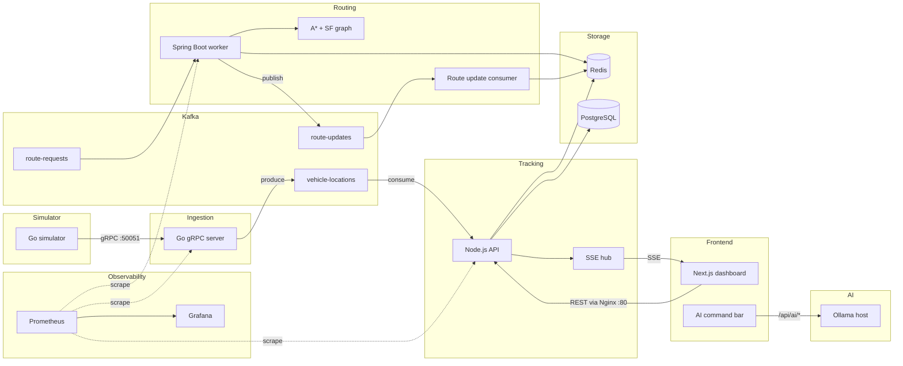

# NexusLogistics

**Real-time distributed vehicle tracking with AI-powered fleet intelligence.**

<p align="center">
  <a href="https://github.com/preethamdandu/NexusLogistics/actions/workflows/test.yaml"></a>
  
  
  
  
  
  
  <a href="https://github.com/preethamdandu/NexusLogistics/blob/main/LICENSE"></a>
  <a href="https://github.com/preethamdandu/NexusLogistics/pulls"></a>
</p>

---

## What is this?

NexusLogistics is a **local-first demo** of a fleet map: trucks, buses, and simulated aircraft show up on a **dark command-center dashboard**, and markers **slide** when new coordinates arrive instead of teleporting. Under the hood, positions ride **gRPC → Kafka → Redis/Postgres → Server-Sent Events**. Type a plain-language question in the **AI command bar** and **Ollama** (model **`gemma4:e2b`**, JSON mode) can return actions the UI understands—**no hosted LLM, no API keys**. The stack is meant to be **cloned, run with Docker Compose, and hacked on**.

**[Get started →](GETTING_STARTED.md)**

---

## Dashboard

<p align="center">
  
</p>

<p align="center"><em>Command center with real-time tracking, AI fleet queries, and live system health.</em></p>

---

## How it works


```mermaid
flowchart LR
  subgraph Simulator
    SIM[Go simulator]
  end

  subgraph Ingestion
    ING[Go gRPC server]
  end

  subgraph Bus["Kafka"]
    K1["vehicle-locations"]
    K2["route-requests"]
    K3["route-updates"]
  end

  subgraph Tracking
    TRK[Node.js API]
    SSE[SSE hub]
  end

  subgraph Routing
    RTE[Spring Boot worker]
    ASTAR[A* + SF graph]
    RUC[Route update consumer]
  end

  subgraph Storage
    RED[(Redis)]
    PG[(PostgreSQL)]
  end

  subgraph Frontend
    UI[Next.js dashboard]
    AIBAR[AI command bar]
  end

  subgraph AI
    OLL[Ollama host]
  end

  subgraph Obs["Observability"]
    PROM[Prometheus]
    GRAF[Grafana]
  end

  SIM -->|gRPC :50051| ING
  ING -->|produce| K1
  K1 -->|consume| TRK
  TRK --> RED
  TRK --> PG
  TRK --> SSE
  SSE -->|SSE| UI
  UI -->|REST via Nginx :80| TRK
  AIBAR -->|"/api/ai/*"| OLL
  K2 --> RTE
  RTE --> ASTAR
  RTE -->|publish| K3
  K3 --> RUC
  RTE --> RED
  RUC --> RED
  PROM -.->|scrape| ING
  PROM -.->|scrape| TRK
  PROM -.->|scrape| RTE
  PROM --> GRAF
```

**How a GPS ping becomes a moving dot**

1. **`ingestion-service/cmd/simulator`** (run on the host) sends **`SendPing`** over **gRPC** to ingestion on **`localhost:50051`** (same port Compose publishes from the ingestion container).
2. Ingestion serializes the ping and produces to Kafka topic **`vehicle-locations`** (`docker-compose.yml` wires **`KAFKA_BROKERS`** for the producer).
3. **`tracking-service`** consumes **`vehicle-locations`**, **`SET`s** `vehicle:{id}:latest` in Redis with **86400s** TTL, **`INSERT … ON CONFLICT (vehicle_id, timestamp) DO NOTHING`** into Postgres, then calls **`broadcastLocationUpdate`** (`tracking-service/src/consumers/locationConsumer.ts`).
4. The browser opens **`EventSource`** on **`/api/live/stream`** (see **`useLiveVehicleStream.ts`**); Nginx proxies that to **`GET /live/stream`** on tracking with **buffering off** (`gateway/nginx.conf`). Each **`location-update`** event updates React state; **`VehicleLayer`** animates markers over **1500ms** using **`requestAnimationFrame`** (`frontend/src/components/Map/VehicleLayer.tsx`).
5. **Prometheus** scrapes **ingestion** (container metrics port), **tracking** `:3000`, and **route** **`/actuator/prometheus`** per **`monitoring/prometheus/prometheus.yml`**—**Grafana** is in Compose if you want charts.

---

## Features

### Three languages, one system

**Go** owns the hot path: unary gRPC, tight structs, a small Kafka producer (`ingestion-service/internal/kafka/producer.go` uses **`acks=all`**). **Node.js** fits the shape of the problem here: lots of concurrent HTTP, Redis, Postgres, KafkaJS, and an in-memory SSE fan-out without bolting a second runtime onto the edge. **Java 17 + Spring Boot 3.1** runs the Kafka-driven route worker with Redis helpers already in the ecosystem. Nobody wins a medal for polyglotting on purpose—the split matches what each service is actually doing.

### Vehicles that actually move

Kafka delivers **at least once**; the UI still feels smooth because **`useLiveVehicleStream`** merges SSE payloads into **`LiveMapVehicle`** (previous lat/lng kept for interpolation). The **Go simulator** loops **10** vehicles—**4** trucks, **2** buses, **4** aircraft—with **`x-vehicle-type`** gRPC metadata and tunables **`-tick`** (default **1500ms**), **`-speed`**, **`-aircraft-speed`** (`ingestion-service/cmd/simulator/main.go`). Markers are drawn with Leaflet; the map uses **CARTO** **`dark_all`** tiles (`frontend/src/components/Map/MapInner.tsx`).

### Ask the fleet a question

The command bar calls the gateway **`POST /api/ai/chat`** with **`format: json`** and model **`gemma4:e2b`** (`frontend/src/lib/fleetAiTypes.ts`, **`useFleetAi.ts`**). Ollama returns JSON actions (`filter_by_type`, `zoom_to`, `highlight_vehicles`, …); the map applies them. Try *“show me all trucks”*, *“zoom to Seattle”*, *“how many buses are active”*, *“find stopped vehicles”*. Phrases like *show everything* can short-circuit client-side without hitting the model—see **`useFleetAi.ts`**. **Zero cloud LLM bill** if Ollama is running on the machine; the gateway reaches **`host.docker.internal:11434`** (`gateway/nginx.conf`).

### A* routes over real coordinates

The route worker snaps the vehicle to the nearest node on a **19-node** undirected **San Francisco** graph (**Haversine** edge weights in meters; depot id **`sf-hub`** in **`SanFranciscoRoadNetwork.java`**), runs **`AStar.shortestPath`**, then publishes JSON on **`route-updates`**. A **Redis** lock per vehicle (`setIfAbsent` on `lock:route:{vehicleId}`, **10s** TTL in `RouteOptimizer.java`) keeps concurrent jobs from stomping the same vehicle. ETA in responses uses a fixed **30 km/h** assumption (`AVERAGE_SPEED_KMH` in `RouteOptimizer.java`)—honest demo math, not a traffic model.

### Idempotent from bus to database

The consumer uses **`ON CONFLICT (vehicle_id, timestamp) DO NOTHING`** because Kafka can redeliver. The unique constraint comes from **`tracking-service/migrations/post-init-002-vehicle-locations-unique.sql`** (mounted by **`docker-compose.yml`** on fresh Postgres volumes). Duplicate timestamps are **expected noise**, not a crisis—Postgres drops them and the world keeps turning.

### Dark mode command center

There is **no light theme toggle shipping as the primary experience**—the UI is built around **`--cc-*`** tokens and the same CARTO dark basemap. Glowing markers, speed rings, trail polylines, a terminal-style **live feed**, and **gateway-backed health probes** are in the Next.js app (`frontend/src/app/page.tsx`, `globals.css`, map components).

---

## Quick start

```bash
git clone https://github.com/preethamdandu/NexusLogistics.git
cd NexusLogistics
docker compose up -d
cd ingestion-service && go run ./cmd/simulator &
# Open http://localhost:3002
```

AI setup, Ollama checks, Grafana URLs, and “why is my gateway 502?” live in **[GETTING_STARTED.md](GETTING_STARTED.md)**—read that next.

---

## Performance

Measured with **k6**, **60s** sustained **`constant-vus`**, **Docker Compose on one laptop** (recorded **2026-04-10**, image **`grafana/k6:0.56.0`**). Reproduce: **`benchmarks/k6/run-all.sh`**. HTTP scenarios hit **tracking `:3000` directly**, not Nginx—so they **do not** exercise gateway **`limit_req`**.

| Scenario | VUs | Throughput | P50 | P95 | P99 |
|----------|-----|--------------|-----|-----|-----|
| gRPC `SendPing` (`grpc_ingestion.js`) | 25 | **~3402/s** | **7.12ms** | **8.62ms** | **10.37ms** |
| HTTP Redis hot path (`http_tracking_hit.js`) | 40 | **~12471/s** | **2.63ms** | **5.57ms** | **7.66ms** |
| HTTP 404 miss path (`http_tracking_miss.js`) | 40 | **~7850/s** | **4.63ms** | **7.34ms** | **9.42ms** |

Averages from the same run: gRPC **7.28ms** avg; cache-hit HTTP **3.16ms**; 404-path HTTP **5.05ms**. Full methodology and the **`http_req_failed`** vs intentional **404** note: [`benchmarks/k6/README.md`](benchmarks/k6/README.md).

---

## Project structure

```
NexusLogistics/
├── ingestion-service/   # Go — gRPC, Kafka producer, simulator & bench cmds
├── tracking-service/    # Node — REST, Kafka consumer, SSE hub, Redis + Postgres
├── route-service/       # Java — A*, Kafka in/out, Redis locks + status cache
├── frontend/            # Next.js — dashboard, map, AI command bar
├── gateway/             # Nginx — proxy, rate limits, SSE, Ollama passthrough
├── monitoring/          # Prometheus scrape config + Grafana provisioning
├── k8s/                 # Kustomize — deployments, services, ingress, HPA, secrets
├── benchmarks/          # k6 scripts, shell harnesses, optional Go benches
├── docs/                # Screenshots, generated performance notes
├── frontend-bench/      # Small Go HTTP stress tool (separate go.mod)
└── gateway-bench/       # Small Go HTTP stress tool (separate go.mod)
```

---

## Contributing

Pull requests are welcome—typo fixes, tests, docs, and bigger features all count.

**Good first issues (concrete ideas)**

| Idea | Why it helps |
|------|----------------|
| More simulator routes / cities | `ingestion-service/cmd/simulator/main.go` is plain Go structs—easy to extend. |
| Richer AI actions or prompts | `frontend/src/lib/fleetAiPrompt.ts` + `fleetAiTypes.ts`—keep JSON shape backward compatible. |
| Vehicle detail drawer | Click marker → history from `/api/tracking/:id` or Postgres—UI gap today. |
| Replace or augment demo pings | Swap simulator for a CSV/replay file or a small MQTT bridge—great learning project. |
| Alternate map tiles | `MapInner.tsx` tile URL—keep attribution honest. |
| More tests | Tracking already has Jest (`tracking.read-path.test.ts`); Go has `internal/kafka` table tests; route has `AStarTest`, `RouteOptimizerTest`, EmbeddedKafka IT—extend what’s there. |
| Real cluster notes | `kubectl apply -k k8s/` is not continuously validated on EKS/GKE/AKS—field reports as docs or PRs are gold. |
| SSE + something bidirectional | Today is SSE-only from server→browser; a small WS channel for “ping vehicle” could be a contained experiment. |
| Mobile layout pass | Map + side panels need love on narrow viewports. |

**Mechanics**

Fork on GitHub, clone the fork, branch, run the same checks CI runs (from **`.github/workflows/test.yaml`**):

```bash
git checkout -b feat/my-change

cd frontend && npm ci && npm run lint && npm run build
cd ../tracking-service && npm ci && npm test && npm run build
cd ../ingestion-service && go vet ./... && go test ./...
cd ../route-service && mvn test -B
```

Push the branch and open a PR against **`main`**.

**Commit messages (short convention)**

| Prefix | Use for |
|--------|---------|
| `feat` | New behavior |
| `fix` | Bug fixes |
| `docs` | README, comments only |
| `test` | Tests only |
| `refactor` | No behavior change |
| `perf` | Faster / leaner paths |

---

## API (via gateway)

Base URL: **`http://localhost:80`**. Nginx applies **`limit_req`** (**100 r/s**, burst **50**) on most **`/api/*`** routes; **`/api/metrics`** is stricter (**10 r/s**); **`GET /api/live/stream`** has **no** rate limit and **`proxy_buffering off`** (`gateway/nginx.conf`).

| Method | Path | What it does |
|--------|------|----------------|
| GET | `/health` | Static JSON from Nginx (`{"status":"healthy",…}`) |
| GET | `/api/tracking/:id` | Latest vehicle JSON (Redis, else Postgres fill + cache) |
| GET | `/api/vehicles` | All `vehicle:*:latest` keys from Redis (**SCAN**, not `KEYS`) |
| GET | `/api/live/all` | Merged live view (cached sim + probes) |
| GET | `/api/live/stream` | **SSE** stream (`event: connected`, `event: location-update`, `:ping` every **15s**) |
| GET | `/api/live/trucks` | Filtered live JSON |
| GET | `/api/live/buses` | Filtered live JSON |
| GET | `/api/live/aircraft` | OpenSky-backed fetch from tracking (may fail gracefully in UI) |
| POST | `/api/routes/calculate` | Enqueues route job (Spring returns **202** when accepted) |
| GET | `/api/routes/status/:id` | Cached route JSON or **404** JSON if Redis miss |
| GET | `/api/metrics` | Prometheus text from tracking |
| POST | `/api/ai/chat` | Proxied to Ollama **`/api/chat`** (needs **`gemma4:e2b`**) |

Curl examples and CORS quirks: **[GETTING_STARTED.md](GETTING_STARTED.md)**.

---

## Testing

| Service | Command | What runs |
|---------|---------|-----------|
| Ingestion | `cd ingestion-service && go test ./...` | **`go vet`** in CI too; includes **`internal/kafka`** marshal tests |
| Tracking | `cd tracking-service && npm test` | Jest + Supertest against **`createApp`** |
| Route | `cd route-service && mvn test -B` | A* unit tests, route optimizer tests, **EmbeddedKafka** consumer integration |
| Frontend | `cd frontend && npm run lint && npm run build` | ESLint + Next production build (TypeScript checked as part of **`next build`**) |

CI also runs **`npm run lint --if-present`** / **`npm run type-check --if-present`** where those scripts exist (tracking has no lint script today; frontend has no separate **`type-check`** script—**`next build`** carries the weight).

---

## Deployment

**Docker Compose (local):** `docker compose up -d` from the repo root. Ports worth bookmarking: gateway **80**, frontend **3002**, Grafana **3001**, Prometheus **9090**, Kafka UI **8080**, ingestion gRPC **50051** (`docker-compose.yml`).

**Kubernetes:** `kubectl apply -k k8s/` after reviewing secrets in **`k8s/secrets/`**. **`kustomize build k8s/`** is exercised in **`.github/workflows/ci.yaml`** alongside image builds. Treat cloud deployment as **best-effort manifests** until someone reports success on a real cluster—if that’s you, open an issue or PR with what broke and how you fixed it.

---

## License

Apache 2.0 — free to use, modify, and distribute. Attribution required.

See [LICENSE](LICENSE) and [NOTICE](NOTICE).

---

Built for tinkering. If you read this far, you might as well clone it.

[Report a bug](https://github.com/preethamdandu/NexusLogistics/issues) · [Request a feature](https://github.com/preethamdandu/NexusLogistics/issues) · [Getting Started](GETTING_STARTED.md)
